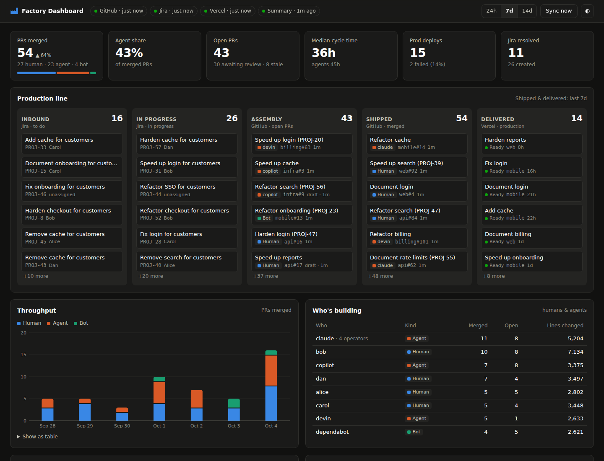

# factory-dashboard

Shows the work done across a GitHub organization the way a factory dashboard would, for a human operator. See what your whole organization is delivering, humans and agents: Jira tickets coming in, GitHub PRs going out, Vercel deployments. It runs on your computer, syncs data locally with the `gh`, `acli` and `vercel` CLI tools, and uses `pi` to write summaries and changelogs.



## What you get

- **Production line**: Inbound (Jira to do) → In progress (Jira) → Assembly (open PRs) → Shipped (merged PRs) → Delivered (Vercel production deploys).
- **Key figures**: PRs merged (and the change vs the previous window), agent share, open PRs that are awaiting review or stale, median cycle time (humans vs agents), production deploy failure rate, and Jira tickets resolved vs created.
- **Throughput chart**: merged PRs per day or hour, stacked by human, agent and bot.
- **Who's building**: humans and coding agents side by side. Agent-assisted PRs opened from a human's account also list that human as the agent's operator.
- **Repositories**: merges, agent share and the last production deploy for each repo.
- **Changelog**: a 24h / 7d changelog plus a watch list, written by `pi`.
- **Activity feed** of merges, new PRs, deploys and Jira changes.

## Requirements

These CLIs need to be installed and logged in. If a CLI is missing, the dashboard skips that source and shows why.

| Source | CLI | Check |
|---|---|---|
| GitHub | [`gh`](https://cli.github.com) | `gh auth status` |
| Jira | [`acli`](https://developer.atlassian.com/cloud/acli/) | `acli jira auth status` |
| Vercel | [`vercel`](https://vercel.com/docs/cli) | `vercel whoami` |
| Summaries | [`pi`](https://github.com/badlogic/pi-mono) | `echo hi \| pi -p "reply ok"` |

You need Go 1.22+ to build.

## Install & run

```sh
make install                 # builds and installs to ~/.local/bin/factory-dashboard
factory-dashboard init       # optional: writes ~/.factory-dashboard/config.json
factory-dashboard            # starts in the background and opens http://127.0.0.1:7420/
```

| Command | What it does |
|---|---|
| `factory-dashboard` / `start` | Start the daemon in the background (detached), then open the browser. If it's already running, just opens the browser. |
| `serve` | Run in the foreground. Use this from launchd or systemd. |
| `stop` / `restart` | Stop or restart the background daemon. |
| `status` | Show whether it's running, its memory use, and the result of each source's last sync. |
| `sync` | Sync now. |
| `open` | Open the dashboard. |

To start it at login, use [`contrib/com.factory-dashboard.plist`](contrib/com.factory-dashboard.plist) on macOS or [`contrib/factory-dashboard.service`](contrib/factory-dashboard.service) (a systemd user unit) on Linux. Setup steps are in the comments at the top of each file.

To try it without any accounts, run `make demo`. It uses fake CLIs with made-up data and serves on port 7421.

## Configuration

Config lives in `~/.factory-dashboard/config.json`. Change the location with `FACTORY_DASHBOARD_HOME`. Every field is optional:

```jsonc
{
  "port": 7420,
  "bind": "127.0.0.1",          // keep it local; the data is your org's activity
  "sync_interval": "15m",
  "summary_interval": "6h",     // pi only runs again if the activity actually changed
  "lookback_days": 14,

  "github_owners": [],          // ["my-org", "user:me"]; empty = every org `gh` can see
  "agent_logins": [],           // extra logins to count as coding agents

  "jira_jql": "",               // empty = "updated >= -14d ORDER BY updated DESC"
  "jira_limit": 300,

  "vercel_scopes": [],          // team slugs; empty = the CLI's current scope

  "pi_provider": "", "pi_model": "",
  "pi_args": ["-p", "--no-session", "--no-tools", "--no-context-files", "--no-extensions", "--no-skills"],

  "memory_limit_mb": 48,
  "github_enabled": true, "jira_enabled": true, "vercel_enabled": true, "summary_enabled": true
}
```

## How it stays light

The daemon is one Go binary (about 7 MB) with the web UI embedded. In testing it sits at **about 8–10 MB RSS** when idle, including right after a sync.

- **No data is kept in memory.** Each sync writes compact JSON to `~/.factory-dashboard/data/`. The server streams those files straight to the browser, and all the aggregation happens in the browser.
- **One goroutine runs the syncs, one CLI at a time.** This keeps peak memory low for both the daemon and the child processes. After each sync it forces a GC and returns freed memory to the OS (`debug.FreeOSMemory`).
- **A soft memory limit** (`memory_limit_mb`, default 48 MB) plus `GOGC=50` and `GOMAXPROCS=2`. If you set `GOMEMLIMIT`, `GOGC` or `GOMAXPROCS` in the environment, those win.
- **The UI only polls a tiny status endpoint** every 30s, and pauses while the tab is hidden. It re-downloads the data only after a sync has actually run.
- **No build step and no runtime dependencies.** The frontend is plain HTML, CSS and JS.

## How it classifies humans vs agents

Each PR is labelled `human`, `agent` or `bot`. The checks run in this order:

1. The login is in `agent_logins` → agent.
2. The login matches a known maintenance bot (dependabot, renovate, github-actions, …) → bot.
3. The login contains a known agent name (copilot, claude, devin, cursor, codex, jules, openhands, …) → agent.
4. Any other GitHub App or bot account → bot.
5. The branch starts with an agent prefix (`claude/`, `codex/`, `copilot/`, `cursor/`, `devin/`, …) → agent, with the human as its operator.
6. The PR body has an agent trailer ("Generated with [Claude Code]", "Co-Authored-By: Claude", Devin/Cursor/Codex links, …) → agent.

Jira keys (`ABC-123`) found in PR titles and branch names link PRs to tickets. That's how "in progress, no PR" is flagged.

## Security notes

- The server binds to `127.0.0.1` by default. Requests with an unexpected `Host` header are rejected, which blocks DNS-rebinding attacks. POSTs need a custom header, so other websites can't trigger syncs.
- PR titles and ticket summaries are untrusted input. `pi` is called with `--no-tools`, so prompt-injected text can't make it run commands. It also runs from the data directory with context files, extensions and skills disabled.

## Development

```sh
make test     # unit tests: parsers, classifier, request guard
make demo     # run against fake CLIs on :7421
```
